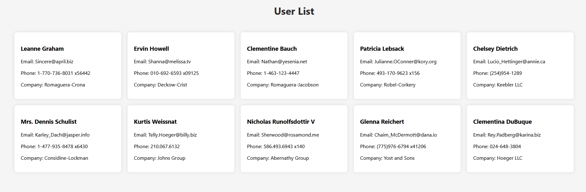

# UseEffect API Fetching Task

In this task, you'll create a react app that is responsible for fetching and displaying a list of users from [JSONPlaceholder](https://jsonplaceholder.typicode.com/users) API. Your goal is to implement data fetching using the `useEffect` hook and ensure that the user list is rendered correctly.

## Task Instructions

1. **Data Fetching**: The component currently fetches user data from the [JSONPlaceholder](https://jsonplaceholder.typicode.com/users) API using the fetch function. Ensure that the data is fetched successfully and stored in the users state.

2. **Rendering Users**: Render the list of users retrieved from the API. Each user should be displayed as a list item with their name, email, phone number & company.

3. **Error Handling**: Implement error handling for the data fetching process. If an error occurs during the fetch operation, render an error message telling the user to reload the page.

4. **Loading Indicator**: create a loading indicator for the data fetching process. If the data is being fetched, render the loading indicator, it can be a simple "Loading..." text or a spinner.

Don't forget to style your application using CSS or any CSS framework of your choice.

